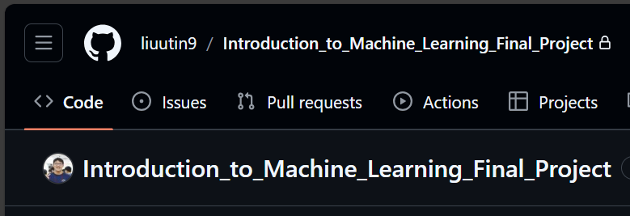
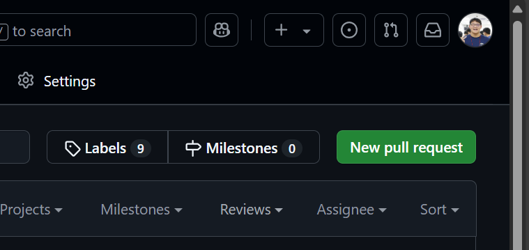
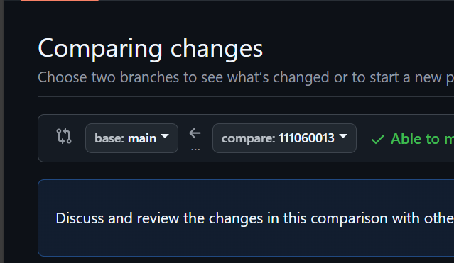
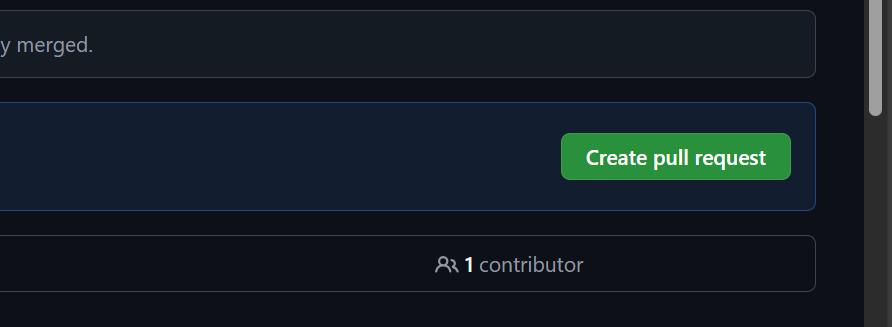
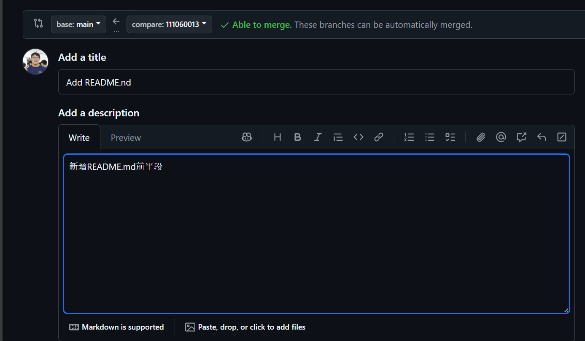
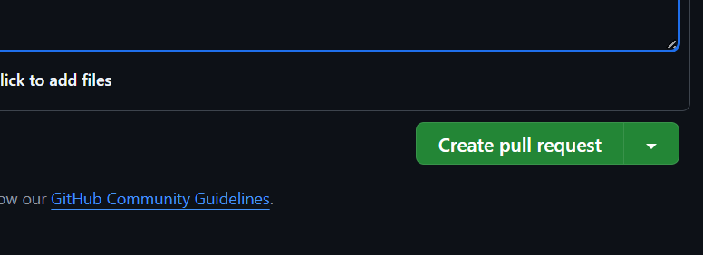
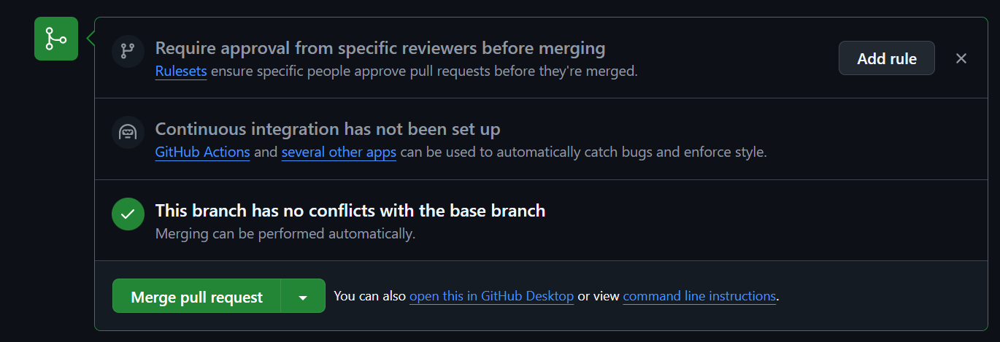
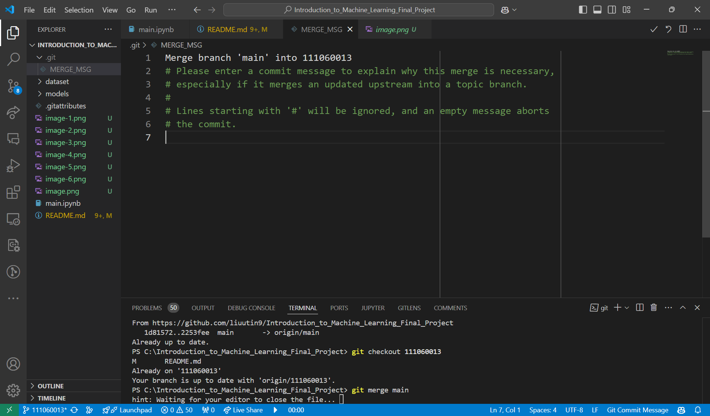

# Machine Learning Final Project

## Initial Steps:
### Step 1: Clone the repository.  
`git clone https://github.com/liuutin9/Introduction_to_Machine_Learning_Final_Project.git`
### Step 2: Create your own local branch
`git branch <your local branch>`

---

## Daily Steps: (Work Flow)
### Step 1: Checkout to main branch
`git checkout main`
### Step 2: Pull data from remote branch
`git pull`
### Step 3: Checkout to your local branch
`git checkout <your own branch>`
### Step 4: Merge main to your local branch
`git merge main`  
**Ensure that you are on your local branch**
### Step 5: Type your code
Pada Pada
### Step 6: Add the changed files
`git add . `
### Step 7: Commit your changes
`git commit -m "<commit message>"`  
**Please write the commit message clearly**
### Step 8: Checkout to main branch
`git checkout main `
### Step 9: Pull the newest data
`git pull`
### Step 10: Checkout to your local branch
`git checkout <your local branch>`
### Step 11: Merge main to your local branch
`git merge main`
### Step 8: Push to your remote branch
`git push -u origin <your student ID>`

---

## Pull Request
If you have done your work and want to merge it into remote main branch, go to Github Website and do the following steps.

### Step 1: Go to "Pull requests"

### Step 2: Click "New pull request"

### Step 3: Select your compare branch

### Step 4: Click "Create pull request"

### Step 5: Type the title and description

### Step 6: Click "Create pull request"

### Step 7: Click "Merge pull request" and Click "Confirm merge"
**Please ensure that there are no errors or warnings**

### Done

---

**If you see this, click v at the top right corner.**
